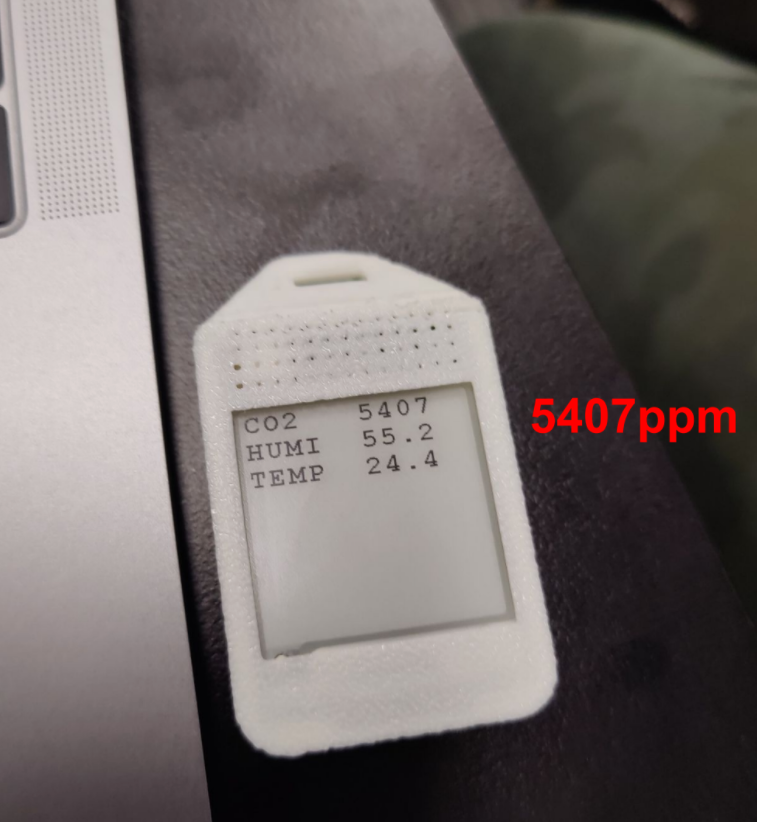
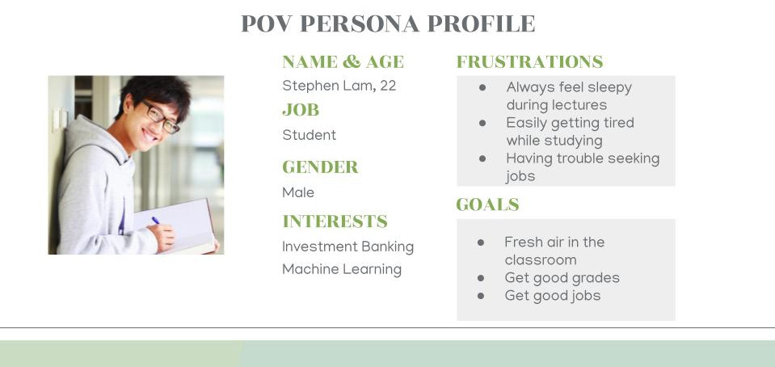
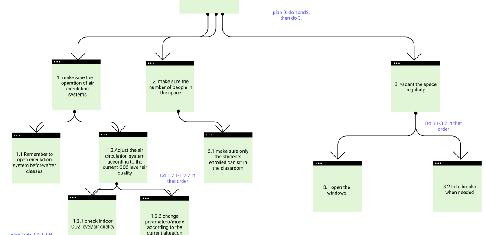
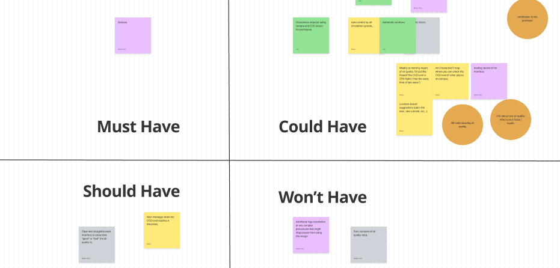
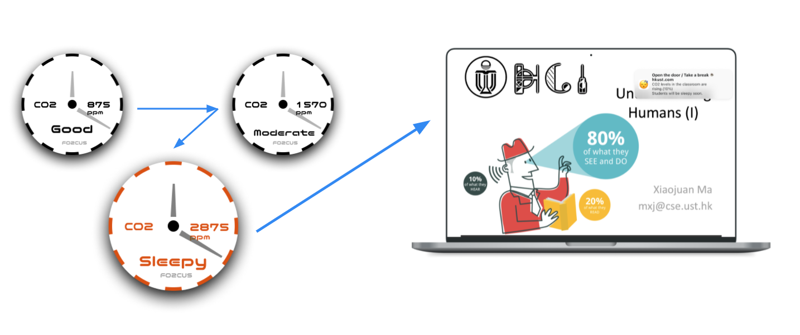
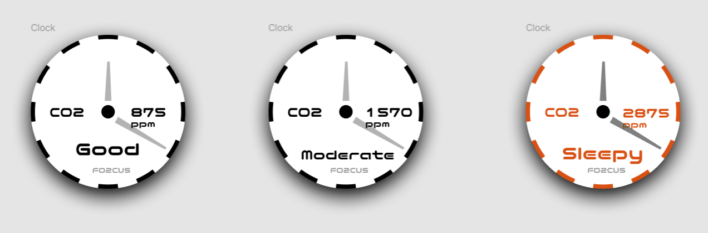

# FO2CUS: Help Students Focus by Lowering CO2 Level in Classrooms
Yukai ZHANG, Bincan GUO, Yui KONDO, Shiang-an TSAI, Han-si TAO
## Overview
Students often find themselves feel sleepy in confined classroom during long lectures. This is partly due to CO2 accumulating in the classroom. In this project, we investigated the problem through interview and designed FO2CUS, a smart classroom system that display CO2 level in real-time alerts students and teachers when CO2 concentration rises beyond the healthy level.

## Background
At HKUST, there is no window in most classrooms and the circulation of air depends entirely on the ventilation system. Our experience and observation show that classroom is not well ventilated: students often feel drowsiness during long lectures and CO2 concentration in classroom can reach 5000 ppm, much higher than the healthy level of 1000 ppm while high CO2 concentration leads to lower cognitive capability.

*CO2 concentration measured at a HKUST classroom with a DIY CO2 censor*

## Need
We interviewed students at HKUST from different grades and majors to understand their needs regarding the issue. We asked if they have ever experienced tiredness, sleepiness or other comfortableness at HKUST campus and how do they resolve the problem. 

Most interviewees said they have experienced sleepiness during face-to-face lectures for various reasons.  Some of them said a break during the lecture would help, but they felt embarrassed to interrupt the lecture by asking for a break. 

*User Persona*

With the information collected from interviews, we created persona for our target user and formulated our problem statement:
How might we keep students focused during lectures by maintaining CO2 level in a reasonable range without requiring any embarrassing actions? 

## Concept Ideation
Based on the interview, we summarized all the actions that students and professors can take to ventilate the classroom during a long lecture, and we then constructed a Hierarchical Task Analysis (HTA) framework to explore the design opportunities to tackle the problem we have identified.

*Hierachical Task Analysis*

To facilitate innovation, we brainstormed product concepts and features that could potentially solve the problem. We also adopted MoSCoW to organize features.

*MoSCoW*

## The Concept
Our concept a smart classroom system called FO2CUS. Its main component is a clock embedded with sensor and real time display for CO2. When CO2 level reaches a preset threshold, the clock will turn red to alert students and professors so that they can take actions such as open the door or take a break. In addition, the clock in wireless connected to the classroom desktop computer and a notification will be shown on the desktop to suggest the instructor to give students to take a break. 

*FO2CUS Concept*

A [video](https://youtu.be/KIjGsEQSl0o) is made to demonstrate the user experience.

We design the system in a form of a clock so that the device can be placed where it is visible for both instructors and students. The clock is also where students look at when they feel tired during a lecture, therefore the design can also raise the awareness of the health-related impact of CO2 concentration among students.

## Personal Reflection
This project is very positive experience for me. Having a design background, I have always understood the importance of design thinking in innovation. In this project, by following the design thinking methodologies, our team is able to discover a problem that has been overlooked. I am also glad that we found an innovative approach to the problem.

During the project, I participated expensively in the user research and ideation process. I interviewed two HKUST students to gain insight on the issue and worked with my teammates on the ideation process which lead to our final concept. 

In the prototyping stage, I am designed the clock interface and edited the video prototype for demonstrating the user experience. Thorough the process, I practiced my skills on various prototyping tools and gained experiences in video editing, storyboarding, and creating visual prototype on Figma. 
