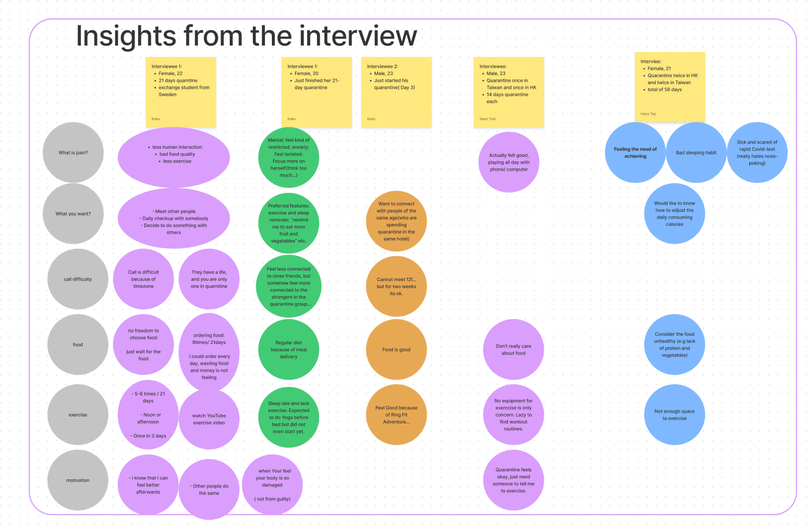
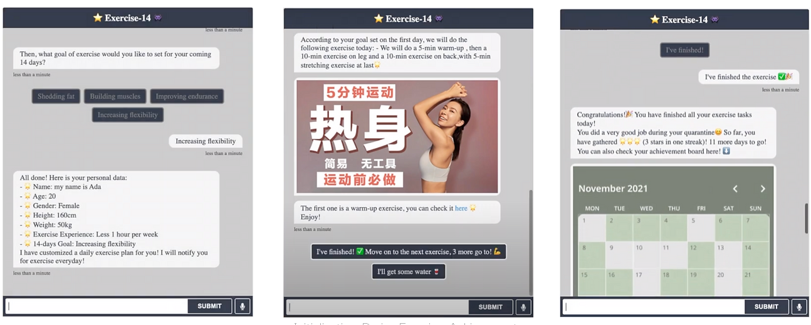
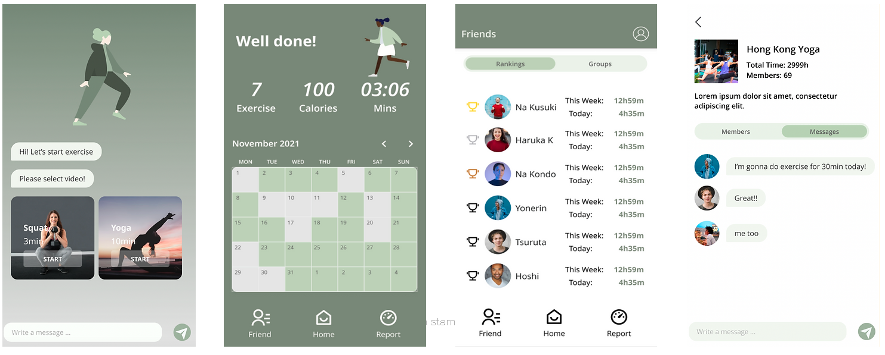

# Exercise-14: A Motivating Chatbot for Exercise in Quarantine

## Overview
Exercise-14 is an APP designed for motivating people under quarantine to work out. The main feature of the application is a chatbot that provides users with customized exercise plans according to information gathered from the user. Other features include sharing exercise achievements and connecting to other users for a shared challenge. 

## Background
Since the COVID-19 outbreak, many people have gone through quarantine which requires people to be isolated in a room with very limited social interaction. We want to explore what problems people may have during quarantine and solve the problem with an interactive chatbot. 

## Need Gathering
We conducted interviews with our friends and family to learn more about problems people have encountered during quarantine. Many interviewees said that they are not doing enough exercise. One interviewee specifically mentioned that she planned to do yoga every day at the beginning of the quarantine, but she ended up not doing it at all because she did have the discipline when being alone. 
We learned from the interview that many people wanted to do exercise during quarantine to stay healthy but most of them are not motivated enough when they are alone. With this finding, we framed the problem statement for the project: How might we motivate users to take small steps towards their goals during quarantine by providing customized exercise goals suitable for a small space?

## Ideate
To facilitate innovative solutions, we brainstormed features in the chatbot that could help us achieve our goal, and we used MoSCoW to prioritize these features. We decided the features needed include:
1.	Customized exercising plan
2.	Motivating poster at the end of the exercise
3.	Challenges users can join with friends to do exercise together

_PNG.png)

## Prototype
We implemented an interactive functional prototype with Rasa. The prototype is a Rasa chatbot that gathers user information and sent users recommended exercises daily based on user information. In addition, a look-like prototype is also designed to demonstrate the look and feel of the chatbot as well as other features including motivating posters and group challenges. A video is made with these prototypes to demonstrate the purpose and usage of the application. 

## User Testing
A speed dating verification is done for a few of our original interviewees. Most of the interviewees gave positive feedback. Some people specifically mentioned they like how the APP can connect them with other people. 

## Personal Reflection 
In the project, I made the storyboard and implemented part of the functional prototype. Specifically, I implemented the conversation that asks users for personal information and stores them with Rasa. I also participated in all the group discussions and brainstorming that led to the current problem statement and design. 
The experience of working on the Rasa chatbot is especially rewarding. I was following the tutorial mostly for the implementation, but I also tried additional features not mentioned in the tutorial such as buttons. During the implementation, I also realized that building a flexible and intelligent chatbot is more difficult than it seems to be at the beginning. Our prototype has a relatively fixed conversation pattern, but as I tried to make it compatible with more variations of user inputs, it becomes harder for the chatbot to identify the user intent, and a lot more training samples are needed for the chatbot to function as intended. Overall, I believe the skill I gained from working on the chatbot is very practical and I can imagine myself using Rasa for my future projects.
