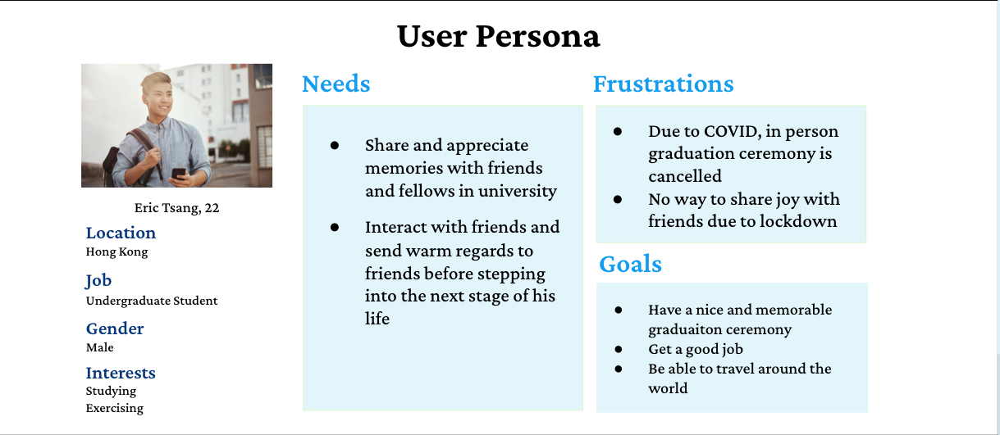
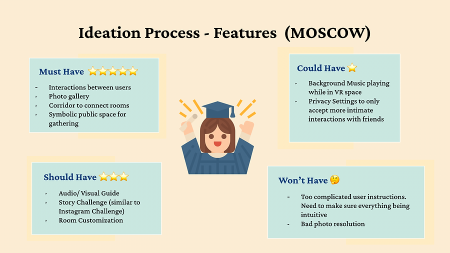
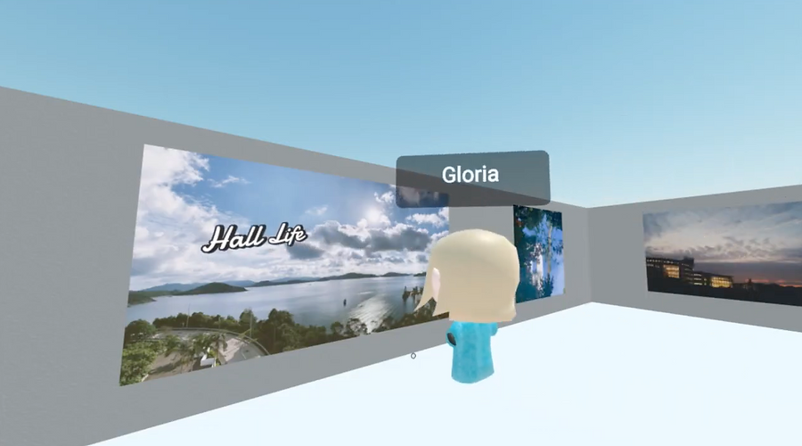
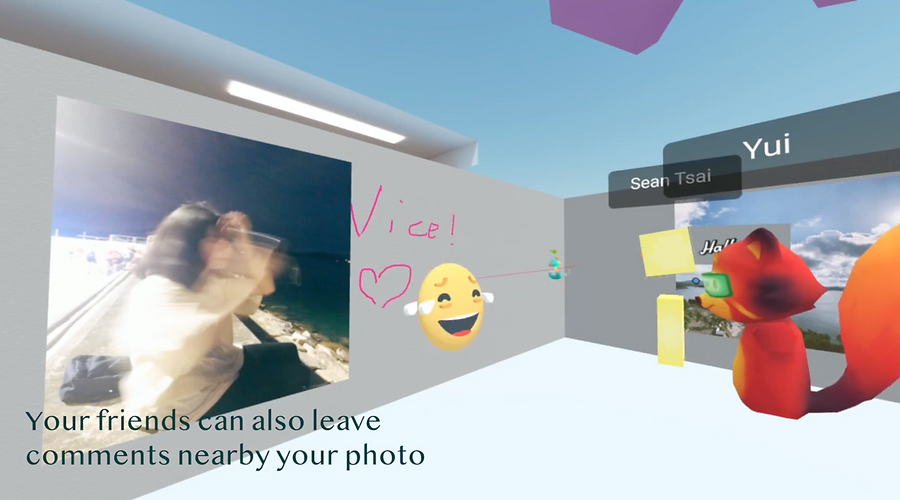
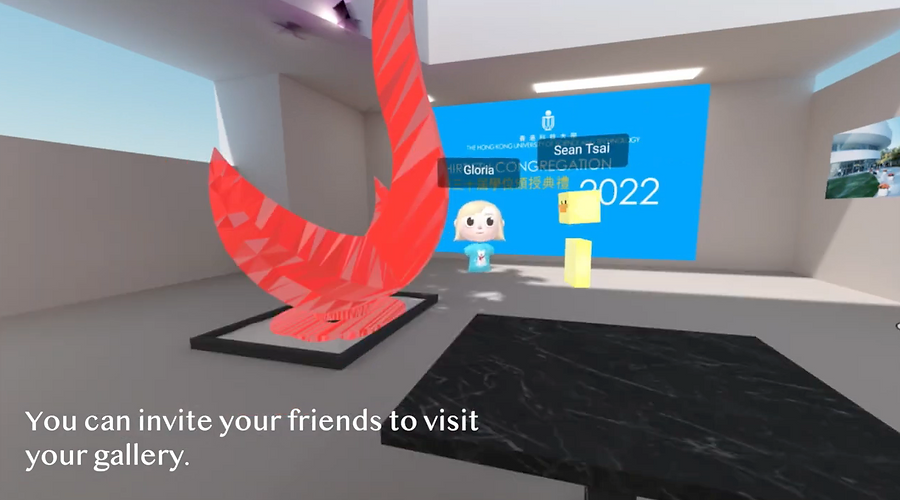
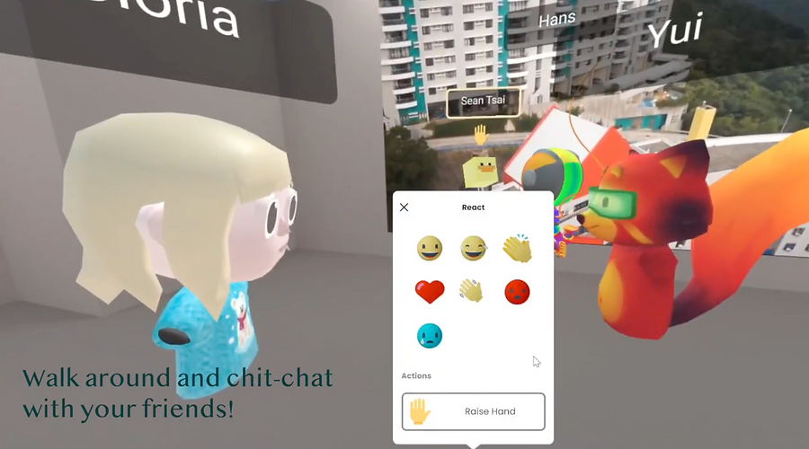
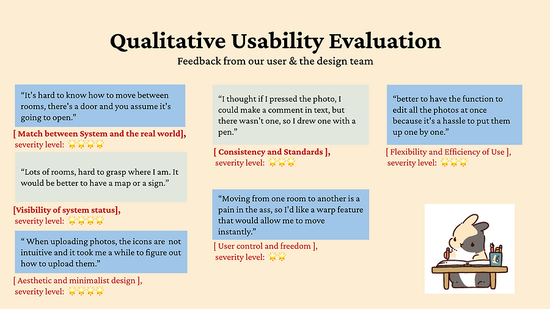
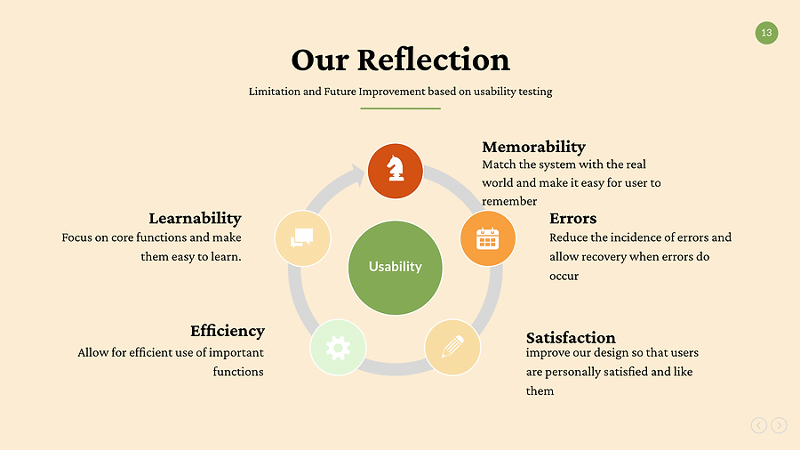

# GradVRation: Graduation in Virtual Reality

Yukai ZHANG, Bincan GUO, Yui KONDO, Shiang-an TSAI, Han-si TAO

## Overview
In recent years, many university graduates cannot attend the graduation ceremony due to the COVID-19 outbreak. As a result, they might miss their last chance to talk and connect with their university friends. The goal of GradVRation is to create a VR space for the graduation ceremony, where students can interact with their friends, share their memories, and celebrate a new chapter of their lives. 

## Problem and Need
Being a final year student who cannot attend the graduation ceremony myself, the idea of a VR graduation ceremony immediately catches my eye during our brainstorming session. To better understand the need of UST students, we also interviewed eight HKUST and created a user persona to better represent our target users. After narrowing down our scope, we came up with our problem statement: How might we create an immersive and personalized graduation ceremony experience, to satisfy the needs of UST graduates that are forced to conduct remote ceremonies due to COVID?

## Concept Ideation
We applied MOSCOW to prioritize our features. Features we think that should be included in the concept includes:
* Must-Have:
    * Interactions between users
    * Photo gallery
    * Corridor to connect rooms
    **Symbolic public space for gathering
* Could-Have
    * Background music playing while in VR space
    * Privacy setting to only accept more intimate interactions with friends

## Prototype
A prototype of GradVRation is implemented with Mozilla Spoke and Mozilla Hub. The virtual environment for the graduation ceremony consists of a piazza for gathering and customized individual rooms for displaying photos and videos of individual students. Rooms are connected with corridors where users can put photos and videos of their shared experiences. Such a layout encourages students to visit other people’s rooms and explore connections among students. A video is made to demonstrate the prototype.

## Usability Testing
We conducted usability testing with 2 users who are graduating this year. A list of problems (rated on a scale of 0 to 4) is found:

Based on the feedback, we summarize our reflections into 5 points:
* **Learnability**  
It is difficult for users to find where they can upload their photos as there are many irrelevant buttons built into Mozilla Hub. Future prototypes can improve the user interface and make uploading content more intuitive.
* **Efficiency**  
Some users find it difficult to navigate through rooms. A map should be provided to the user.
* **Memorability**  
Users are confused when a door cannot be opened in the prototype. The behavior of the system should match that of the real world to make the operation intuitive.
* **Errors**  
Users find it frustrating when they cannot erase the comment they left on an image. Recovery should be allowed when errors occur.
* **Satisfaction**  
Users said that they can feel more connected if there are commentaries next to photos. Commentaries can be added to make users more satisfied.

## Personal Reflection
In this project, I am mainly responsible for implementing the prototype. I constructed the most of virtual scene (three rooms and the inter-connected corridors) using the architectural kit in Mozilla Spoke. To make the scene more unique, I put a UST firebird status in the piazza and other 3D models I made previously in the individual rooms. Prototyping Mozilla Spoke and Hubs is a new experience for me, and I was amazed that a VR experience can be prototyped so quickly on this platform. However, it can be difficult for users to distinguish individual rooms in the current prototype as the layout and textures are the same for all rooms. Given more time, the layout of the scene can be made more unique, interesting, and personalized. 

As a final-year student who cannot attend the graduation ceremony, this project is very meaningful for me. After the prototype is completed, I enjoy the interaction when we put on our photos for decoration. Even though team members are in different places, the prototype makes me feel that we are together. I enjoyed the project and I think it is a great conclusion to my university life.
